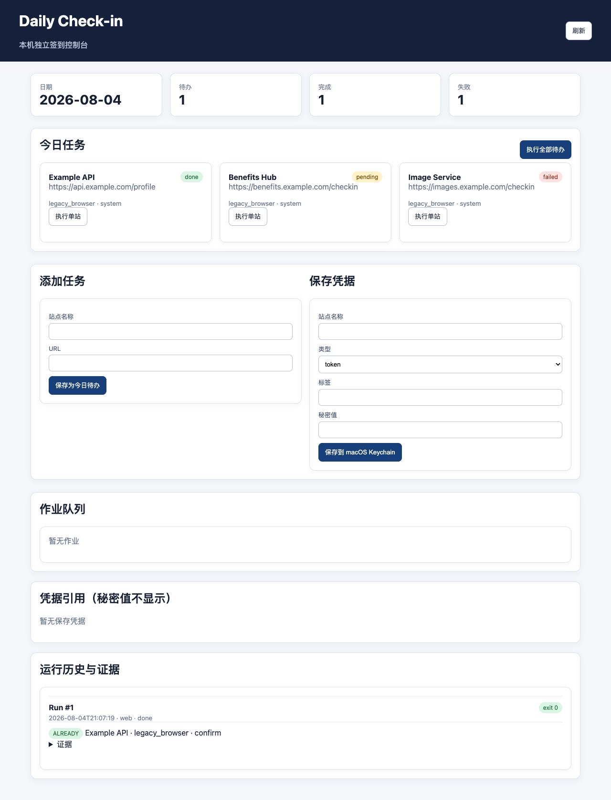

# Daily Check-in

A local-first, evidence-driven multi-site check-in system for macOS and an existing Chrome CDP session.

它不是“点击到了就算成功”的签到脚本。每个成功结果必须经过业务确认，并记录 action、confirmation、provider、stage 与失败原因。

- SQLite 是权威任务与运行数据库
- Obsidian 是任务导入与结果投影界面；SQLite 是系统运行权威
- macOS Keychain 保存账号、Cookie、Token 和密码
- 本地 Web UI 支持任务、凭据、单站/全站执行、队列和运行证据
- 复用已有 headed Chrome，不启动、不杀死浏览器
- 无确认不成功，CDP 硬故障不会被误报为正常完成



## 主要特性

### 独立任务系统

运行状态默认保存在：

```text
~/.hermes/checkin/system.db
```

SQLite 数据库管理：

- 站点目录
- 每日任务
- 运行批次和单站结果
- Web 作业队列
- credential reference

系统每天会从已启用站点目录生成待办。Obsidian 只负责导入与结果投影；文件缺失、iCloud 未挂载或单行投影失败时，SQLite 中已登记的任务仍会独立运行，业务结果不会被降级。

### Evidence-first 成功门

```text
页面动作 action
    ↓
业务确认 confirmation
    ↓
OK / ALREADY
```

点击按钮本身不产生成功结果。支持的证据类型包括：

- `dom_strong`
- `dom_done_state`
- `network_response`
- `server_status`
- `api_success`

当前通用 provider 主要使用严格 DOM 确认；未经验证的站点 API 不会被猜测调用。

### 安全的 Chrome 生命周期

- 仅连接已有 Chrome CDP
- 不调用 `chromium.launch()`
- 不调用远端 `Browser.close()`
- 使用 `/json/new` 创建静默临时 target
- 只按精确 CDP target ID 绑定页面
- 只关闭本轮 target 和由 `openerId` 证明归属的 OAuth popup
- 无法证明归属时宁可失败，不操作未知标签
- 默认拒绝纯 headless endpoint
- 自动发现硬优先 `chrome-checkin-profile`

### 本地 Web UI（前后端分离）

控制台现在分成两个进程：

- **前端（静态页面）**：`http://127.0.0.1:8766`
- **后端（API）**：`http://127.0.0.1:8765`

支持：

- 今日任务和状态汇总
- 添加系统任务
- 单站执行
- 全部站点执行
- FIFO 作业队列
- 运行历史和 evidence
- Keychain 凭据保存、引用查看和删除

两个进程都只允许 loopback 绑定；后端启用随机 CSRF token、Host allow-list、`Cache-Control: no-store` 和精确 Origin CORS allow-list；前端静态服务保留 CSP、`no-store`、`nosniff` 安全头。

这是项目自带的轻量本地前端,不是独立的 SaaS 服务:

- 页面文件在 `web/` (`index.html`、`app.js`、`style.css`),无需 npm、Node、React/Vue 或前端构建步骤。
- 前端是独立的只读静态服务（`scripts/serve-frontend.py`,默认端口 8766）,不具备 API、凭据、runner 或文件写入能力。
- 后端在 `checkin_core/web.py`,提供 loopback HTTP API（默认 8765)、FIFO job queue、认证/CSRF/CORS 和 run evidence。
- 前端通过显式 `API_BASE`（默认 `http://127.0.0.1:8765`)调用 API;登录使用密码（`DAILY_CHECKIN_WEB_PASSWORD`）。旧 Bearer `web.token` 仍被接受以保持兼容。
- 默认只监听 `127.0.0.1`;不要通过反向代理直接暴露公网。

### 与参考仓库的关系

架构设计参考 `qixing-jk/all-api-hub` 的 provider、API-first、native-page action 和 server-side confirmation 思路。参考仓库有自己的 Web 前端;本项目没有复制其前端或运行时,而是保留独立的 Python/CDP/SQLite/Keychain 实现,并使用上面的无构建 HTML/CSS/JavaScript 前端。

### Keychain 凭据

可以保存：

- account
- cookie
- token
- password

秘密值进入 macOS Keychain：

```text
service = com.mango.daily-checkin
```

SQLite 只保存凭据引用、类型、标签和更新时间。秘密值不会进入 system.db、JSONL、Git 或 Web 状态 API。

通用 DOM provider 不会自动读取凭据。只有站点专用 provider 明确实现消费规则后，凭据才会注入页面或请求，防止跨站泄漏。

## 系统要求

- macOS
- Python 3.10+
- Google Chrome 或 Chromium
- Chrome 已使用独立 profile 开启 Remote Debugging
- `lsof` 和 macOS `security` CLI

Hermes Agent 和 Obsidian 都是可选集成，不是核心运行依赖。

## 快速开始

### 1. 克隆与安装

```bash
git clone https://github.com/dengyie/daily-checkin.git
cd daily-checkin

python3 -m venv .venv
source .venv/bin/activate
pip install -r requirements.txt
playwright install chromium
```

runner 通过 CDP 连接系统 Chrome；Playwright 下载的 Chromium 不会由 runner 自动启动。

### 2. 启动独立 Chrome profile

Chrome 136+ 通常要求 Remote Debugging 使用非默认 user-data-dir。

```bash
open -n -a "Google Chrome" --args \
  --remote-debugging-address=127.0.0.1 \
  --remote-debugging-port=9222 \
  --user-data-dir="$HOME/chrome-checkin-profile" \
  --no-first-run \
  --no-default-browser-check
```

在这个 profile 中手动完成站点登录。runner 不负责启动或终止 Chrome。

检查 CDP：

```bash
curl -fsS http://127.0.0.1:9222/json/version
```

### 3. 启动 Web UI（前后端分离）

先启动后端 API:

```bash
.venv/bin/python -m checkin_core.web \
  --host 127.0.0.1 \
  --port 8765
```

再启动前端静态服务:

```bash
.venv/bin/python scripts/serve-frontend.py \
  --host 127.0.0.1 \
  --port 8766
```

浏览器访问:

```text
http://127.0.0.1:8766
```

前端通过 `API_BASE`（默认 `http://127.0.0.1:8765`)调用后端 API。登录使用密码 `DAILY_CHECKIN_WEB_PASSWORD`;未设置时可回退 Bearer `web.token`。如需在其它端口部署前端,设置 `DAILY_CHECKIN_WEB_ORIGINS` 并把 `web/app.js` 前注入 `window.API_BASE`。

从前端添加任务，或配置 Obsidian 目录后导入任务。

### 4. CLI 运行

```bash
# 解析系统任务但不连接 Chrome
.venv/bin/python stealth_checkin_runner.py --dry-run

# 执行所有 pending 任务
.venv/bin/python stealth_checkin_runner.py

# 执行指定站点；站点必须存在于系统目录
.venv/bin/python stealth_checkin_runner.py --only "Site A,Site B"

# 严格使用指定 CDP endpoint
.venv/bin/python stealth_checkin_runner.py --cdp 9222

# 只重试带有 Obsidian #auto-fail 的 pending 任务
.venv/bin/python stealth_checkin_runner.py --retry-auto-fail
```

## 配置

复制示例：

```bash
mkdir -p "$HOME/.config/daily-checkin"
cp config/env.example "$HOME/.config/daily-checkin/env"
```

这个文件只用于本地路径和运行参数，不应保存 Cookie、Token 或密码。Hermes wrapper 会自动加载它；直接运行 CLI 或 Web UI 前请导出：

```bash
set -a
source "$HOME/.config/daily-checkin/env"
set +a
```

常用配置：

```bash
DAILY_CHECKIN_TASKS_DIR="$HOME/path/to/obsidian/Task/daily"
DAILY_CHECKIN_DB="$HOME/.hermes/checkin/system.db"
DAILY_CHECKIN_LOG_DIR="$HOME/.hermes/checkin"
CDP_PORT=9222
```

环境变量：

| 变量 | 默认值 | 说明 |
|---|---:|---|
| `DAILY_CHECKIN_TASKS_DIR` | `~/Documents/daily-checkin/tasks` | 可选 Obsidian 每日任务目录 |
| `DAILY_CHECKIN_DB` | `~/.hermes/checkin/system.db` | SQLite 权威数据库 |
| `DAILY_CHECKIN_LOG_DIR` | `~/.hermes/checkin` | wrapper、JSONL、last-run 和 lock 目录 |
| `DAILY_CHECKIN_ROOT` | 自动推导 | wrapper 复制安装时的仓库绝对路径 |
| `CDP_HTTP` | 自动发现 | 指定 CDP HTTP endpoint |
| `CDP_PORT` | 自动发现 | 指定 CDP 端口 |
| `SITE_TIMEOUT_S` | `90` | 单站总墙钟超时 |
| `BATCH_TIMEOUT_S` | `6600` | runner 自身批次 deadline，早于 Hermes 外层 timeout |
| `BATCH_CLEANUP_RESERVE_S` | `30` | deadline 前保留的收口时间 |
| `CAPTCHA_WAIT_S` | `40` | 人机验证等待 |
| `CF_WAIT_S` | `40` | Cloudflare 等待 |
| `SSO_TIMEOUT_S` | `45` | SSO 总等待 |
| `CTA_WAIT_S` | `8` | 登录 CTA 等待 |
| `SIGN_WAIT_S` | `8` | 签到按钮等待 |
| `CONNECT_RETRIES` | `3` | CDP 连接重试次数 |
| `CONNECT_RETRY_BACKOFF_S` | `1.5` | 线性重试退避基数 |
| `CHECKIN_PROVIDER_ENGINE` | `provider` | 设置为 `legacy` 可回滚 provider engine |

显式 CLI `--cdp` 的优先级高于环境变量。

## Obsidian 集成

Obsidian 是可选外部任务界面。任务格式：

```markdown
- [ ] #task #日常 [Example API](https://api.example.com/profile)
```

运行结果投影：

```markdown
- [x] #task #日常 [Example API](https://api.example.com/profile)
```

失败保持未勾选，并附加稳定原因：

```markdown
- [ ] #task #日常 [Example API](https://api.example.com/profile) #auto-fail:no_confirm
```

权威关系：

- 新的 Obsidian 任务会导入 SQLite
- 系统已有状态不会被旧 checkbox 无条件覆盖
- 系统结果会投影回 Obsidian
- Obsidian 暂时不可用不阻断系统任务
- 投影失败会记录 `projection_status` / `projection_reason`，但不会把已确认的 `OK` 改成失败，也不会把后续独立站点标成 `batch_aborted`
- 只有 CDP 断连、整批超时等基础设施故障才会中止后续站点；404、403、Cloudflare、验证码和业务资格不足按单站原因记录

默认每日文件名：

```text
YYYY-MM-DD 每日任务.md
```

可通过 `--task-file` 覆盖单次路径。

## 调度

任何能执行命令的调度器都可以调用：

```bash
/path/to/daily-checkin/.venv/bin/python \
  /path/to/daily-checkin/stealth_checkin_runner.py \
  --source cron
```

### Hermes Agent 集成

仓库包含一个 Hermes pre-run wrapper：

```bash
mkdir -p "$HOME/.hermes/scripts"
cp "$PWD/scripts/daily-checkin-cdp.sh" \
  "$HOME/.hermes/scripts/daily-checkin-cdp.sh"
chmod 755 "$HOME/.hermes/scripts/daily-checkin-cdp.sh"

printf '\nDAILY_CHECKIN_ROOT="%s"\n' "$PWD" >> \
  "$HOME/.config/daily-checkin/env"
```

wrapper 会：

- 在单个 Python 进程内完成 CDP 预检和 runner，避免外层 timeout 留下孤儿签到进程
- 将预检选中的完整 endpoint 固定传给 runner，不做第二次自动发现
- 输出 `wakeAgent` JSON
- 成功时保持静默
- 失败时允许 Hermes 生成摘要
- 不自动补跑失败站点

大量站点需要给 Hermes pre-run script 足够的总预算。例如 75 站、单站 90 秒时：

```bash
hermes config set cron.script_timeout_seconds 7200
```

Hermes 2026.6.5 的配置 schema 可能提示该键未注册，但 scheduler 会直接读取它；可用 scheduler 的实际解析结果或一次 dry-run 验证生效。runner 默认在 `6600s` 自行中止并完成 SQLite、JSONL 和状态收口，Hermes 的 `7200s` 仅作为外层兜底。

Hermes 会拒绝解析后逃出 `~/.hermes/scripts` 的 symlink，因此 pre-run wrapper 必须是普通文件。仓脚本更新后重新复制；`DAILY_CHECKIN_ROOT` 用于定位 runner 和虚拟环境。

手动设置方式：

```bash
export DAILY_CHECKIN_ROOT="/path/to/daily-checkin"
```

## 架构

```text
Web UI / CLI / Scheduler
          │
          ▼
     FIFO job queue
          │
          ▼
 Check-in orchestrator ──────── SQLite system.db
          │                     ├─ sites / daily_tasks
          │                     ├─ runs / run_items
          │                     ├─ jobs
          │                     └─ credential refs
          │
          ├─ CDP discovery and ownership
          ├─ SSO / Cloudflare / CAPTCHA gates
          ├─ provider registry
          ├─ action evidence
          └─ confirmation evidence
                    │
                    ▼
            existing headed Chrome

macOS Keychain ◄── credential secrets
Obsidian      ◄── optional import / projection
JSONL         ◄── append-only compatibility log
```

主要模块：

| 文件 | 责任 |
|---|---|
| `stealth_checkin_runner.py` | CLI、CDP、SSO、legacy DOM flow、批次编排 |
| `scripts/daily-checkin-cron.py` | Hermes 单进程 preflight、固定 endpoint、日志和 gate 输出 |
| `scripts/daily-checkin-cdp.sh` | 加载本地配置并 `exec` Python cron entry 的薄入口 |
| `checkin_core/store.py` | SQLite schema、任务、运行、job、credential refs |
| `checkin_core/keychain.py` | macOS Keychain 秘密存取 |
| `checkin_core/web.py` | loopback Web UI 和 FIFO job executor |
| `checkin_core/models.py` | action、confirmation、identity evidence 合同 |
| `checkin_core/registry.py` | provider 选择 |
| `checkin_core/providers/` | provider 实现与 legacy bridge |
| `web/` | 无构建步骤的 HTML/CSS/JavaScript 前端 |

## 结果与退出码

| code | 含义 |
|---:|---|
| `0` | 无任务、dry-run 或全部 OK/ALREADY |
| `1` | 至少一个站点失败 |
| `2` | CDP/基础设施硬故障 |
| `3` | wrapper 预检找不到可用 headed CDP |
| `4` | 已有签到批次持有 singleton lock |

CDP 中途断开时：

- 最终 exit 保持 `2`
- 不会被前序成功站点覆盖
- 当前和剩余站点记录 `batch_aborted`

运行输出：

```text
~/.hermes/checkin/system.db
~/.hermes/checkin/YYYY-MM-DD.jsonl
~/.hermes/checkin/last-attempt.json
~/.hermes/checkin/last-run.json
~/.hermes/checkin/cron-YYYY-MM-DD.log
```

`last-attempt.json` 记录每次调用（包括 dry-run）；`last-run.json` 保留最近一次业务运行，dry-run 不覆盖它。

这些文件不应提交到 Git。

## Provider 状态

当前生产默认路径是 `LegacyBrowserProvider`，通过严格 DOM/SSO fallback 承接现有站点。`WisartProvider` 只负责图片公益站的显式匹配和能力边界；在没有真实协议证据前，不执行猜测 API。

New-API 风格 URL 可以使用通用 selector pack，但不会因此自动调用 `/api/user/checkin`。API-first 只能在 provider 明确验证 capability 后启用。

当前已落地：

- Phase A：结果与证据字段、失败分类和可观测性。
- Phase B：provider contract、registry、legacy bridge。
- Phase E：singleton lock、target ownership、CDP 双条件探活、full/targeted 运行范围隔离。
- `CHECKIN_PROVIDER_ENGINE=legacy` 运行时回滚开关。

当前未完成：

- Wisart 登录后脱敏协议探针和真实“未签到 -> 成功”样本。
- 通用 verified API-first provider。
- Wisart 次日 cron 自动样本。

## 测试

```bash
source .venv/bin/activate

python test_stealth_checkin_m1.py
python -m unittest discover -s tests -p 'test_*.py'
python -m py_compile \
  stealth_checkin_runner.py \
  checkin_core/*.py \
  checkin_core/providers/*.py \
  tests/*.py
node --check web/app.js
bash -n scripts/daily-checkin-cdp.sh
git diff --check
```

当前实现状态：

- Phase A：结果与证据字段、失败分类和可观测性已落地。
- Phase B：provider contract、registry、legacy bridge 已落地。
- Phase E：singleton lock、target ownership、CDP 双条件探活和运行范围隔离已落地。
- Phase C（Wisart）：仅完成显式 provider 边界，尚无登录后协议探针和真实未签到成功样本，未启用猜测 API。
- Phase D：通用 verified API-first provider 尚未实现。
- `CHECKIN_PROVIDER_ENGINE=legacy` 已作为运行时回滚开关保留。

当前测试基线：

```text
Legacy regression: 73
System/provider/web behavior: 34
Total: 107
```

当前提供：

- `LegacyBrowserProvider`：生产默认路径，严格 DOM/SSO fallback。
- `WisartProvider`：显式匹配和能力边界；API/status 未经真实协议验证，不执行写 API。


## 安全说明

- Web UI 只能绑定 loopback；不要通过反向代理直接暴露公网
- 不要把秘密放进本地 env 文件
- 不要提交 `system.db`、JSONL、日志、截图、Cookies 数据库或 Chrome profile
- Chrome Remote Debugging 等同于该 profile 的高权限控制接口，只绑定 `127.0.0.1`
- Keychain 项只保存于当前 macOS 用户
- Web UI 能触发真实全站签到；只在你信任的本机运行
- 未知 provider 不会自动消费保存的凭据

安全问题请参见 [`SECURITY.md`](SECURITY.md)。

## 已知限制

- 当前主要面向 macOS；Keychain backend 使用 macOS `security` CLI
- 页面结构和 SSO 流程可能随站点变化
- Turnstile/Cloudflare 不保证自动通过
- 多设备同时运行可能产生重复签到
- Web UI 默认是按需进程，不会自动注册系统服务
- 站点专用 API 必须基于真实协议证据实现
- 这是个人自动化工具，不保证适用于所有站点，也不规避站点服务条款

## 贡献

欢迎提交：

- 新 provider
- 站点 fixture
- 失败分类和 evidence 改进
- 跨平台 credential backend
- 文档和测试

提交 provider 时请附：

1. capability/认证边界
2. 成功与已签到的真实判定
3. 不记录秘密的测试
4. 失败与回滚路径

## License

[MIT](LICENSE)

## Acknowledgements

架构设计参考了 [qixing-jk/all-api-hub](https://github.com/qixing-jk/all-api-hub) 的 provider、API-first、native-page action 和 server-side confirmation 思路。本项目保留独立的 Python/CDP/SQLite/Keychain 实现与安全边界。
