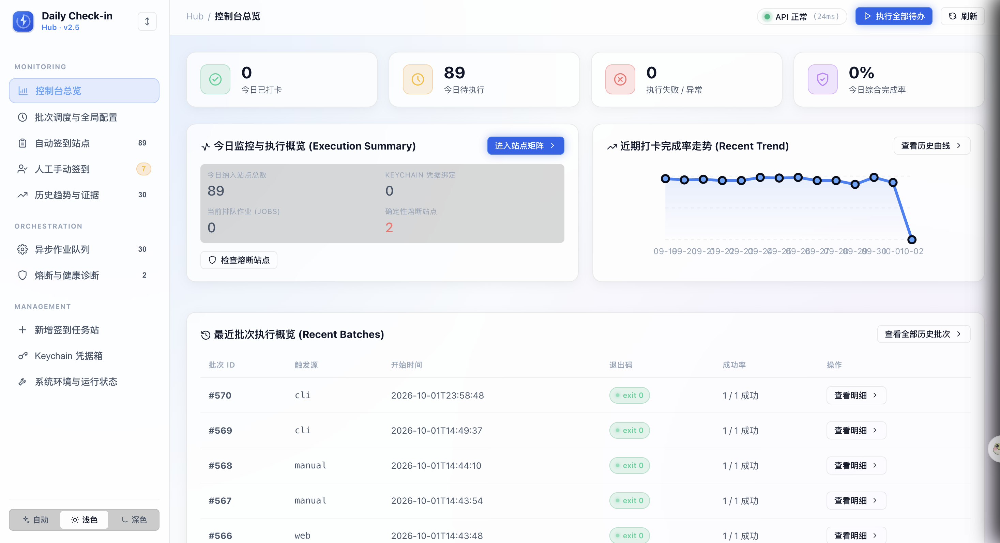

<div align="center">

# 🌟 Daily Check-in

### 泛支持所有网页的全自动签到神器 · 证据驱动 · 零假死 · 极速扩展

[](LICENSE)
[](https://www.python.org/)
[](https://playwright.dev/)
[](SECURITY.md)
[](https://github.com/dengyie/daily-checkin/pulls)

<p align="center">
  <b>不仅是一个脚本，而是一套工业级、高容错、泛用型网页签到与调度系统。</b><br>
  依托原生 Chrome CDP 会话复用，支持几乎所有需要登录、防爬或复杂交互的现代 Web 站点。
</p>

[✨ 核心亮点](#-为什么选择-daily-checkin) •
[🌐 泛网页支持](#-泛网页签到与零代码适配) •
[🚀 快速上手](#-快速上手) •
[🖥️ Web 控制台](#-现代-web-ui-控制台) •
[⚙️ 站点配置指南](#-站点配置与自定义扩展) •
[🧩 架构设计](#-架构与工作原理) •
[🤝 社区贡献](#-参与贡献)

<br>



</div>

---

## 📖 痛点与解决方案

| 传统签到脚本常见痛点 | 🌟 Daily Check-in 解决方案 |
| :--- | :--- |
| **容易掉登录态**：纯 HTTP 请求频繁被风控拦截或 Cookie 过期 | **复用系统 Chrome CDP**：直接共享浏览器真实会话，免除频繁扫码与验证 |
| **虚假成功 (Fake Success)**：点了按钮就报成功，其实被弹窗挡住或签到失败 | **证据驱动架构 (Evidence-First)**：双重核验 DOM 强状态 / 响应数据，无实质业务成功绝不误报 |
| **适配成本高**：每个新网站都要写几十行复杂脚本 | **极简声明式 YAML**：95% 网站只需几行选择器配置，通用智能流自动识别 |
| **弹窗阻断**：全屏广告、活动弹窗、签到日历遮挡点击 | **智能弹窗爆破 (Overlay Zapper)**：自动清理遮罩与阻挡层，精准点击目标 CTA |
| **安全隐患**：明文账号密码写在配置文件中 | **系统级安全隔离**：敏感凭据落入 macOS Keychain 硬件保护，SQLite 仅存引用 |

---

## ✨ 为什么选择 Daily Check-in

### 1. 🌐 泛支持所有网页签到（Universal Web Check-in）
无论是 **New API / One API 中继网关**、各类**论坛社区（Linux.do/Discuz 等）**、**AI 平台**、**云服务商**，还是各类个性化独立站点，只需提供 URL 与简单的 CSS/文本选择器，系统即可自动接入。

### 2. 🛡️ 严格的业务证据驱动（Evidence-Driven Verification）
拒绝“只要没报错就算签到成功”。签到动作执行后，系统会启动证据采集门：
- `dom_strong` / `dom_done_state`: 页面出现“今日已签到”、“明日再来”或签到按钮状态变更为 disabled。
- `network_response` / `api_success`: 捕获到底层签到接口成功回包与积分增加。
- 只有真实捕获到证据才标记 `OK` / `ALREADY`，否则准确归类失败原因（如 `auth_failed`, `no_confirm`, `selector_missing` 等）。

### 3. 🚀 真正的无感 CDP 会话复用（Headless-Proof）
- 自动连接您日常使用的独立 Chrome 调试端口，**不主动启动、不暴力关闭**您的浏览器。
- 通过 CDP `/json/new` 创建静默临时标签页，签到完成后立刻安全销毁，**绝不干扰您正在浏览的标签页**。
- 原生绕过绝大部分自动化检测（Cloudflare Turnstile, WAF, 滑块风控）。

### 4. 🎛️ 开箱即用的精美前后端控制台
- **极简独立**：内置无构建轻量前端（原生 Modern Web Components + CSS 变量，无需 `npm install` 或复杂的 Node 构建环境）。
- **功能齐全**：支持单站即时调试、全站一键执行、实时 FIFO 任务队列、失败重试、健康熔断诊断、运行证据下钻与 Telegram 告警配置。

### 5. 🔌 丰富的生态与联动能力
- **Obsidian 任务联动**：可双向同步 Obsidian 每日任务清单，结果自动打勾投影。
- **Hermes / Cron / 自动化调度**：单进程优雅退出，支持定时静默巡检与异常告警。

---

## 🌐 泛网页签到与零代码适配

Daily Check-in 拥有高度抽象的适配引擎，绝大多数网站无需编写任何 Python 代码，只需在 `sites.yaml` 中声明：

### 场景 A：标准现代网页（只需配置按钮与已签到文本）
```yaml
sites:
  - name: '我的技术论坛'
    url: https://forum.example.com/checkin
    kind: browser
    signs:
      - 'button:has-text("立即签到")'
      - '.checkin-btn'
    already:
      - 'text=今日已签到'
      - 'text=明日再来'
      - 'button:disabled'
```

### 场景 B：New API / One API / 各种 API 聚合中继平台
原生内置 `newapi_profile` 模板，一行搞定全站适配：
```yaml
sites:
  - name: '公益大模型网关'
    url: https://api.example.com/profile
    kind: newapi_profile
```

### 场景 C：静默 API 签到 / 积分接口
有些站点只需登录态并在控制台静默触发 POST 请求：
```yaml
sites:
  - name: '极速签到站点'
    url: https://router.example.com/console
    kind: browser
    signin_api: /api/user/sign_in
```

### 场景 D：深度定制 Provider（高阶扩展）
对于具有极其复杂的前置流程（如 Canvas 刮刮乐、验证码等待、OAuth 跳转）的站点，继承 `BaseCheckinProvider` 即可享受完整的生命周期管理与证据收集能力。

---

## 🚀 快速上手

### 1. 环境准备

- macOS 12+ (推荐)
- Python 3.10+
- Google Chrome 或 Chromium

```bash
# 1. 克隆项目
git clone https://github.com/dengyie/daily-checkin.git
cd daily-checkin

# 2. 创建并激活虚拟环境
python3 -m venv .venv
source .venv/bin/activate

# 3. 安装轻量依赖
pip install -r requirements.txt
playwright install chromium
```

### 2. 启动 Chrome 独立调试会话

> 💡 **为什么需要独立 Profile？**
> Chrome 136+ 安全策略要求远程调试端口绑定独立目录，这保证了签到环境的干净与安全性。

```bash
open -n -a "Google Chrome" --args \
  --remote-debugging-address=127.0.0.1 \
  --remote-debugging-port=9222 \
  --user-data-dir="$HOME/chrome-checkin-profile" \
  --no-first-run \
  --no-default-browser-check
```
*在打开的浏览器窗口中，登录你希望签到的站点账号（登录态会自动持久化保存）。*

验证端口畅通：
```bash
curl -fsS http://127.0.0.1:9222/json/version
```

### 3. 一键运行体验

```bash
# 仿真测试（解析任务、加载站点目录，但不触发真实点击）
python stealth_checkin_runner.py --dry-run

# 执行所有已启用站点的签到
python stealth_checkin_runner.py

# 仅签到指定站点
python stealth_checkin_runner.py --only "fengwind,HotaruAPI"

# 仅重试上一次失败的站点
python stealth_checkin_runner.py --retry-auto-fail
```

---

## 🖥️ 现代 Web UI 控制台

项目自带前后端分离的现代化本地控制台，让批量管理与监控一目了然。

```bash
# 启动后端 API（端口 8765）
python -m checkin_core.web --host 127.0.0.1 --port 8765 &

# 启动前端静态服务（端口 8766）
python scripts/serve-frontend.py --host 127.0.0.1 --port 8766 &
```

打开浏览器访问 **`http://127.0.0.1:8766`**：

- 📊 **总览大盘**：实时展示今日成功数、已签数、失败数与队列运行状况。
- ⚡ **即时调试**：可在面板上对任意单站发起即时运行或批量入队。
- 🔍 **证据回溯**：点击任意历史记录，可查看详细的动作链（Action）与确认证据（Confirmation）。
- 🔔 **通知管理**：在线测试与配置 Telegram 机器人推送。

---

## ⚙️ 站点配置与自定义扩展

### 配置文件结构 (`sites.yaml`)

项目内置了丰富站点的适配模板，你可以直接编辑 `sites.yaml` 增删自己的站点：

```yaml
sites:
  # 示例 1: 通用网页适配（支持多选择器容错回退）
  - name: '示例论坛'
    url: https://linux.do/
    kind: browser
    signs:
      - 'button:has-text("打卡")'
      - '.checkin-action'
    already:
      - 'text=今日已打卡'
      - 'text=已签到'
    ready_rounds: 15          # 页面加载等待轮数
    use_overlay_zapper: true  # 自动清理活动弹窗

  # 示例 2: New API 标准个人中心
  - name: '我的聚合 API'
    url: https://api.my-domain.com/profile
    kind: newapi_profile

  # 示例 3: 带特殊请求头的签到 API
  - name: '专属节点站'
    url: https://node.example.com/console
    kind: browser
    signin_api: /api/v1/user/checkin
    signin_api_uid_header: true
```

### 字段说明表

| 字段 | 类型 | 说明 | 默认值 |
| :--- | :---: | :--- | :---: |
| `name` | `string` | 站点唯一标识名称 | **必填** |
| `url` | `string` | 签到目标页面完整 URL | **必填** |
| `kind` | `string` | 适配类型 (`browser`, `newapi_profile`, `bohe`, `arkengine` 等) | `browser` |
| `signs` | `list` | 签到按钮的定位选择器（按顺序依次尝试） | `[]` |
| `already` | `list` | 已签到状态的判定选择器/文本 | `[]` |
| `ready_rounds`| `int` | 页面就绪轮询最大次数 | `15` |
| `use_overlay_zapper` | `bool` | 是否在点击前自动消除干扰遮罩层与弹窗 | `true` |
| `signin_api` | `string` | 站点内置静默签到 API 路径 | `""` |

---

## 🧩 架构与工作原理

```text
┌────────────────────────────────────────────────────────┐
│               交互层 (Web UI / CLI / Cron)              │
└──────────────────────────┬─────────────────────────────┘
                           │
                           ▼
┌────────────────────────────────────────────────────────┐
│              调度与编排器 (Check-in Engine)             │
│  ├─ FIFO 异步队列       ├─ 单例进程锁 (Singleton Lock)  │
│  ├─ 智能弹窗消除器      ├─ SSO / OAuth 智能跟随         │
│  └─ 失败自动归类分类器   └─ Telegram 告警分发           │
└──────────────┬───────────────────────────┬─────────────┘
               │                           │
               ▼                           ▼
┌───────────────────────────┐ ┌───────────────────────────┐
│     SQLite (system.db)    │ │   macOS Keychain (安全)   │
│ 存储站点元数据/运行批次/证据 │ │ 硬件隔离存储敏感凭据/Token │
└───────────────────────────┘ └───────────────────────────┘
               │
               ▼
┌────────────────────────────────────────────────────────┐
│             真实 Chrome 浏览器 (CDP 会话池)             │
│  ├─ 复用已有登录态       ├─ 静默创建临时 Target          │
│  ├─ 严格生命周期管理     └─ 绕过 Cloudflare / Turnstile  │
└────────────────────────────────────────────────────────┘
```

### 退出码说明（Exit Codes）

方便接入外部 CI/CD 与监控探针：

| Code | 状态 | 含义 |
| :---: | :--- | :--- |
| **`0`** | `SUCCESS` | 全部任务正常完成（或均为已签到状态/Dry-run） |
| **`1`** | `BUSINESS_FAIL` | 存在至少一个站点的业务签到失败（如账号失效、未找到确认证据） |
| **`2`** | `INFRA_FAIL` | 基础设施故障（如 CDP 意外断连、网络不可达） |
| **`3`** | `NO_CDP` | 未检测到活跃的 Chrome Remote Debugging 端口 |
| **`4`** | `LOCKED` | 当前已有正在运行的签到批次持有文件锁 |

---

## 🔒 安全与隐私承诺

- **零数据上传**：本项目完全本地运行，没有中心化统计服务器，不收集任何用户隐私。
- **凭据硬件级隔离**：账号、密码与持久化 Token 均直接存储于 macOS 系统级 Keychain（`com.mango.daily-checkin`），主数据库仅保存引用标识，彻底杜绝提交 Git 时泄密的可能。
- **端口安全限制**：Web UI 与 API 仅绑定 `127.0.0.1` 环回地址，并内置严苛的 Host 校验与 CSRF 防护，不建议且严禁直接暴露在公网环境下。

---

## 🤝 参与贡献

我们非常欢迎社区贡献！无论是新站点的适配规则、核心引擎优化，还是文档完善：

1. **Fork 本仓库** 并创建你的分支：`git checkout -b feature/awesome-site`
2. **添加/测试站点**：在 `sites.yaml` 中添加规则并使用 `--only "YourSite"` 验证
3. **运行测试套件**：
   ```bash
   PYTHONPATH=. python -m unittest discover -s tests -p 'test_*.py'
   ```
4. **提交代码** 并发起 Pull Request 🚀

---

## 📄 开源许可

本项目采用 [MIT 许可证](LICENSE)。

<div align="center">
  <sub>Made with ❤️ by the community. If you find this project helpful, please consider giving it a ⭐!</sub>
</div>
